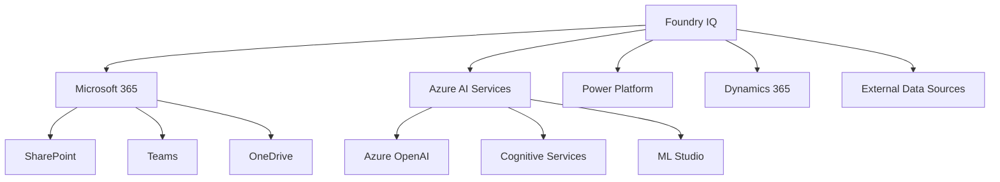
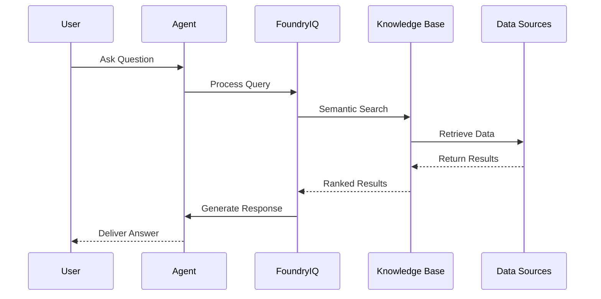

# Foundry IQ:  Complete Guide to Multi-Source AI Knowledge Bases and Agent Creation

> A comprehensive guide to Microsoft Foundry IQ, multi-source knowledge bases, and creating intelligent AI agents in the Microsoft Foundry ecosystem.


---

<div align="center">
  
  <p><em>Microsoft's Unified AI Platform: Work IQ, Fabric IQ, and Foundry IQ Integration</em></p>
</div>

---

## Table of Contents

- [Introduction](#introduction)
- [What is Foundry IQ?](#what-is-foundry-iq)
- [Key Features & Capabilities](#key-features--capabilities)
- [Architecture Overview](#architecture-overview)
- [Getting Started](#getting-started)
- [Creating Agents in Microsoft Foundry](#creating-agents-in-microsoft-foundry)
- [Step-by-Step Implementation](#step-by-step-implementation)
- [Agent Framework Integration](#agent-framework-integration)
- [Code Examples](#code-examples)
- [Best Practices](#best-practices)
- [Security & Compliance](#security--compliance)
- [Troubleshooting](#troubleshooting)
- [Resources](#resources)

---

## Introduction

Microsoft Foundry IQ represents a paradigm shift in how organizations build, deploy, and manage AI-powered knowledge systems. By seamlessly integrating multiple data sources—from enterprise databases to cloud storage, APIs, and real-time data streams—Foundry IQ enables the creation of sophisticated AI agents that can understand context, retrieve relevant information, and provide intelligent responses across your entire data ecosystem.

This guide provides a comprehensive walkthrough of:
- Building multi-source knowledge bases
- Creating and deploying AI agents
- Integrating with existing systems
- Implementing best practices for security and performance
- Leveraging the full power of the Microsoft Foundry ecosystem

---

## What is Foundry IQ?

**Foundry IQ** is Microsoft's enterprise-grade AI platform that combines:

### 🎯 Core Components

1. **Multi-Source Knowledge Integration**
   - Unified access to structured and unstructured data
   - Real-time data synchronization
   - Semantic understanding across data sources

2. **Intelligent Agent Framework**
   - Pre-built agent templates
   - Custom agent development tools
   - Agent orchestration capabilities

3. **Enterprise-Grade Security**
   - Role-based access control (RBAC)
   - Data encryption at rest and in transit
   - Compliance with industry standards

### 🔄 Integration with Microsoft Ecosystem



---

## Key Features & Capabilities

### 1. Multi-Source Data Integration

Foundry IQ supports a wide range of data sources:

| Data Source Type | Examples | Integration Method |
|-----------------|----------|-------------------|
| **Databases** | SQL Server, PostgreSQL, MySQL, CosmosDB | Direct connectors |
| **Cloud Storage** | Azure Blob, SharePoint, OneDrive | Native APIs |
| **APIs** | REST, GraphQL, SOAP | Custom connectors |
| **Files** | PDF, Word, Excel, PowerPoint | Document intelligence |
| **Real-time Streams** | Event Hubs, IoT Hub | Stream processing |

### 2. Knowledge Base Management

```python
# Example: Creating a multi-source knowledge base
from foundry_iq import KnowledgeBase, DataSource

# Initialize knowledge base
kb = KnowledgeBase(name="Enterprise KB")

# Add data sources
kb.add_source(DataSource(
    type="sharepoint",
    connection_string="https://contoso.sharepoint.com/sites/docs",
    refresh_interval="hourly"
))

kb.add_source(DataSource(
    type="sql_database",
    connection_string="Server=myserver;Database=mydb;",
    query="SELECT * FROM products WHERE active=1"
))

kb.add_source(DataSource(
    type="azure_blob",
    connection_string="DefaultEndpointsProtocol=https;...",
    container="documents"
))

# Build and deploy
kb.build()
kb.deploy()
```

### 3. Semantic Search & Retrieval

Foundry IQ uses advanced embeddings and vector search:

```python
from foundry_iq import SemanticSearch

# Configure semantic search
search = SemanticSearch(
    knowledge_base=kb,
    model="text-embedding-ada-002",
    similarity_threshold=0.85
)

# Perform semantic search
results = search.query(
    "What are our Q4 sales projections?",
    top_k=5,
    filters={"department": "sales", "year": 2024}
)

for result in results:
    print(f"Score: {result.score}")
    print(f"Source: {result.source}")
    print(f"Content: {result.content}\n")
```

---

## Architecture Overview

### High-Level Architecture

```
┌─────────────────────────────────────────────────────────┐
│                    User Interface Layer                  │
│  (Teams, Web Portal, Mobile Apps, Custom Apps)          │
└─────────────────────┬───────────────────────────────────┘
                      │
┌─────────────────────▼───────────────────────────────────┐
│                  Agent Orchestration Layer               │
│  • Agent Manager  • Conversation Flow  • Context Mgmt   │
└─────────────────────┬───────────────────────────────────┘
                      │
┌─────────────────────▼───────────────────────────────────┐
│                   Foundry IQ Core                        │
│  ┌──────────────┐  ┌──────────────┐  ┌──────────────┐  │
│  │  Knowledge   │  │   Semantic   │  │     AI       │  │
│  │     Base     │  │    Search    │  │   Models     │  │
│  └──────────────┘  └──────────────┘  └──────────────┘  │
└─────────────────────┬───────────────────────────────────┘
                      │
┌─────────────────────▼───────────────────────────────────┐
│                  Data Integration Layer                  │
│  ┌──────┐  ┌──────┐  ┌──────┐  ┌──────┐  ┌──────┐     │
│  │  DB  │  │ APIs │  │Files │  │Cloud │  │Stream│     │
│  └──────┘  └──────┘  └──────┘  └──────┘  └──────┘     │
└─────────────────────────────────────────────────────────┘
```

### Data Flow



---

## Getting Started

### Prerequisites

- Azure subscription with appropriate permissions
- Microsoft 365 tenant (optional, for M365 integrations)
- Python 3.8+ or .NET 6.0+ (for development)
- Azure CLI installed and configured

### Installation

#### Python SDK

```bash
pip install foundry-iq-sdk azure-identity
```

#### .NET SDK

```bash
dotnet add package Microsoft.FoundryIQ.SDK
```

### Authentication

```python
from azure.identity import DefaultAzureCredential
from foundry_iq import FoundryIQClient

# Authenticate using Azure credentials
credential = DefaultAzureCredential()

# Initialize client
client = FoundryIQClient(
    credential=credential,
    subscription_id="your-subscription-id",
    resource_group="your-resource-group"
)
```

### Quick Start Example

```python
# 1. Create a knowledge base
kb = client.create_knowledge_base(
    name="Customer Support KB",
    description="Customer support documentation and FAQs"
)

# 2. Add data sources
kb.add_source({
    "type": "sharepoint",
    "url": "https://contoso.sharepoint.com/sites/support",
    "document_types": ["*.pdf", "*.docx"]
})

# 3. Create an agent
agent = client.create_agent(
    name="Support Agent",
    knowledge_base=kb,
    system_prompt="""You are a helpful customer support agent. 
    Use the knowledge base to answer customer questions accurately 
    and professionally.""",
    temperature=0.7
)

# 4. Test the agent
response = agent.chat("How do I reset my password?")
print(response.content)
```

---

## Creating Agents in Microsoft Foundry

### Agent Types

1. **Conversational Agents**
   - General Q&A
   - Customer support
   - Virtual assistants

2. **Task-Oriented Agents**
   - Data analysis
   - Report generation
   - Workflow automation

3. **Specialized Agents**
   - Code assistants
   - Research assistants
   - Domain-specific experts

### Agent Configuration

```python
from foundry_iq import Agent, AgentConfig

config = AgentConfig(
    # Model settings
    model="gpt-4",
    temperature=0.7,
    max_tokens=2000,
    
    # Behavior settings
    system_prompt="You are a helpful AI assistant...",
    response_format="markdown",
    
    # Knowledge base settings
    knowledge_bases=["kb-1", "kb-2"],
    search_strategy="hybrid",  # semantic + keyword
    
    # Safety settings
    content_filter="strict",
    pii_detection=True,
    
    # Performance settings
    cache_enabled=True,
    streaming=True
)

agent = Agent(name="My Agent", config=config)
```

### Agent Capabilities

#### 1. Tool Integration

```python
from foundry_iq import Tool

# Define custom tools
@Tool(
    name="get_weather",
    description="Get current weather for a location"
)
def get_weather(location: str) -> dict:
    # Implementation
    return {"location": location, "temperature": 72, "condition": "sunny"}

@Tool(
    name="calculate",
    description="Perform mathematical calculations"
)
def calculate(expression: str) -> float:
    return eval(expression)  # Use safely in production!

# Add tools to agent
agent.add_tools([get_weather, calculate])

# Agent can now use these tools
response = agent.chat("What's the weather in Seattle and what's 25 * 4?")
```

#### 2. Memory & Context

```python
from foundry_iq import MemoryManager

# Configure memory
memory = MemoryManager(
    type="conversation",
    max_history=10,
    summarization=True
)

agent.set_memory(memory)

# Multi-turn conversation with context
agent.chat("My name is John")
agent.chat("I'm interested in cloud computing")
response = agent.chat("What topics have we discussed?")
# Agent remembers: name and interest in cloud computing
```

#### 3. Multi-Agent Collaboration

```python
from foundry_iq import AgentTeam

# Create specialized agents
researcher = Agent(name="Researcher", role="research")
writer = Agent(name="Writer", role="content_creation")
reviewer = Agent(name="Reviewer", role="quality_assurance")

# Create agent team
team = AgentTeam(
    agents=[researcher, writer, reviewer],
    workflow="sequential"
)

# Collaborative task
result = team.execute_task(
    "Create a comprehensive blog post about quantum computing"
)
```

---

## Step-by-Step Implementation

### Example: Building a Customer Support Agent

#### Step 1: Set Up the Environment

```python
import os
from foundry_iq import FoundryIQClient, KnowledgeBase, Agent
from azure.identity import DefaultAzureCredential

# Set up authentication
credential = DefaultAzureCredential()

# Initialize client
client = FoundryIQClient(
    credential=credential,
    subscription_id=os.getenv("AZURE_SUBSCRIPTION_ID"),
    resource_group="customer-support-rg"
)
```

#### Step 2: Create Knowledge Base

```python
# Create knowledge base
kb = client.create_knowledge_base(
    name="customer-support-kb",
    description="Customer support documentation, FAQs, and policies"
)

# Add multiple data sources
sources = [
    {
        "type": "sharepoint",
        "url": "https://contoso.sharepoint.com/sites/support",
        "filters": {
            "file_types": ["pdf", "docx"],
            "modified_after": "2024-01-01"
        }
    },
    {
        "type": "sql_database",
        "connection_string": os.getenv("SQL_CONNECTION_STRING"),
        "tables": ["faq", "product_docs", "policies"]
    },
    {
        "type": "web_pages",
        "urls": [
            "https://contoso.com/support",
            "https://contoso.com/faq"
        ],
        "crawl_depth": 2
    }
]

for source in sources:
    kb.add_source(source)

# Build knowledge base (indexing)
print("Building knowledge base...")
kb.build()
print("Knowledge base ready!")
```

#### Step 3: Configure Agent

```python
from foundry_iq import AgentConfig

# Define agent configuration
agent_config = AgentConfig(
    model="gpt-4",
    temperature=0.7,
    max_tokens=1500,
    
    system_prompt="""
    You are a helpful and professional customer support agent for Contoso Inc.
    
    Your responsibilities:
    1. Answer customer questions using the knowledge base
    2. Be polite, empathetic, and professional
    3. If you don't know the answer, say so and offer to escalate
    4. Provide step-by-step instructions when appropriate
    5. Always verify customer identity for account-specific queries
    
    Guidelines:
    - Use clear, concise language
    - Provide relevant links to documentation
    - Offer follow-up assistance
    - Never make up information
    """,
    
    knowledge_bases=[kb.id],
    search_strategy="hybrid",
    
    # Enable safety features
    content_filter="strict",
    pii_detection=True,
    
    # Performance optimization
    cache_enabled=True,
    streaming=True
)

# Create agent
agent = client.create_agent(
    name="customer-support-agent",
    config=agent_config
)
```

#### Step 4: Add Custom Tools

```python
from foundry_iq import Tool
import requests

@Tool(
    name="check_order_status",
    description="Check the status of a customer order by order ID"
)
def check_order_status(order_id: str) -> dict:
    """Check order status from order management system"""
    api_url = f"https://api.contoso.com/orders/{order_id}"
    response = requests.get(
        api_url,
        headers={"Authorization": f"Bearer {os.getenv('API_TOKEN')}"}
    )
    return response.json()

@Tool(
    name="create_ticket",
    description="Create a support ticket for complex issues"
)
def create_ticket(customer_id: str, issue: str, priority: str = "medium") -> dict:
    """Create a support ticket"""
    ticket_data = {
        "customer_id": customer_id,
        "issue": issue,
        "priority": priority,
        "status": "open"
    }
    response = requests.post(
        "https://api.contoso.com/tickets",
        json=ticket_data,
        headers={"Authorization": f"Bearer {os.getenv('API_TOKEN')}"}
    )
    return response.json()

# Add tools to agent
agent.add_tools([check_order_status, create_ticket])
```

#### Step 5: Implement Conversation Loop

```python
from foundry_iq import ConversationSession

# Create conversation session
session = ConversationSession(agent=agent)

def chat_loop():
    """Interactive chat loop"""
    print("Customer Support Agent Ready!")
    print("Type 'exit' to end the conversation\n")
    
    while True:
        user_input = input("Customer: ")
        
        if user_input.lower() in ['exit', 'quit', 'bye']:
            print("Agent: Thank you for contacting Contoso support. Have a great day!")
            break
        
        # Get agent response
        response = session.send_message(user_input)
        
        print(f"Agent: {response.content}\n")
        
        # Display sources if available
        if response.sources:
            print("📚 Sources:")
            for source in response.sources:
                print(f"  - {source.title} ({source.url})")
            print()

# Run chat loop
chat_loop()
```

#### Step 6: Deploy to Production

```python
# Deploy agent
deployment = agent.deploy(
    environment="production",
    scaling={
        "min_instances": 2,
        "max_instances": 10,
        "target_utilization": 0.7
    },
    monitoring={
        "enable_logging": True,
        "enable_metrics": True,
        "alert_email": "support-team@contoso.com"
    }
)

print(f"Agent deployed! Endpoint: {deployment.endpoint}")
```

---

## Agent Framework Integration

### Autogen Integration

```python
import autogen
from foundry_iq import FoundryIQClient

# Configure Autogen with Foundry IQ
config_list = [
    {
        "model": "gpt-4",
        "api_type": "foundry_iq",
        "foundry_client": client,
        "knowledge_base_id": kb.id
    }
]

# Create Autogen assistant with Foundry IQ backend
assistant = autogen.AssistantAgent(
    name="assistant",
    llm_config={
        "config_list": config_list,
        "temperature": 0.7,
    }
)

# Create user proxy
user_proxy = autogen.UserProxyAgent(
    name="user",
    human_input_mode="NEVER",
    code_execution_config={"use_docker": False}
)

# Start conversation
user_proxy.initiate_chat(
    assistant,
    message="Analyze our Q4 sales data and create a summary report"
)
```

### LangChain Integration

```python
from langchain.agents import initialize_agent, AgentType
from langchain.tools import Tool
from foundry_iq.integrations.langchain import FoundryIQLLM, FoundryIQRetriever

# Create Foundry IQ components
llm = FoundryIQLLM(client=client, model="gpt-4")
retriever = FoundryIQRetriever(knowledge_base=kb)

# Create LangChain tools
tools = [
    Tool(
        name="Knowledge Base Search",
        func=retriever.get_relevant_documents,
        description="Search the knowledge base for information"
    )
]

# Create agent
agent = initialize_agent(
    tools=tools,
    llm=llm,
    agent=AgentType.ZERO_SHOT_REACT_DESCRIPTION,
    verbose=True
)

# Use agent
result = agent.run("What are the company policies on remote work?")
```

### Semantic Kernel Integration

```csharp
using Microsoft.SemanticKernel;
using Microsoft.FoundryIQ;

// Create Semantic Kernel
var kernel = Kernel.CreateBuilder()
    .AddFoundryIQChatCompletion(
        deploymentName: "gpt-4",
        client: foundryClient,
        knowledgeBaseId: kbId
    )
    .Build();

// Create plugin
var plugin = kernel.CreatePluginFromPromptDirectory("plugins/CustomerSupport");

// Use with knowledge base
var result = await kernel.InvokeAsync(
    plugin["AnswerQuestion"],
    new KernelArguments
    {
        ["question"] = "How do I return a product?",
        ["search_kb"] = true
    }
);

Console.WriteLine(result);
```

---

## Code Examples

### Example 1: RAG (Retrieval-Augmented Generation)

```python
from foundry_iq import RAGPipeline, RerankingStrategy

# Create RAG pipeline
rag = RAGPipeline(
    knowledge_base=kb,
    model="gpt-4",
    retrieval_strategy="hybrid",
    reranking=RerankingStrategy.CROSS_ENCODER
)

# Configure retrieval parameters
rag.configure_retrieval(
    top_k=10,
    similarity_threshold=0.75,
    diversity_penalty=0.3
)

# Configure generation parameters
rag.configure_generation(
    temperature=0.7,
    max_tokens=1000,
    citation_style="inline"
)

# Generate response with citations
response = rag.generate(
    query="What are the best practices for securing cloud infrastructure?",
    include_citations=True
)

print(response.answer)
print("\nCitations:")
for citation in response.citations:
    print(f"[{citation.id}] {citation.title} - {citation.url}")
```

### Example 2: Multi-Modal Agent

```python
from foundry_iq import MultiModalAgent, ImageAnalyzer, DocumentAnalyzer

# Create multi-modal agent
agent = MultiModalAgent(
    name="Document Analyzer",
    capabilities=["text", "image", "document"]
)

# Add analyzers
agent.add_analyzer(ImageAnalyzer(model="gpt-4-vision"))
agent.add_analyzer(DocumentAnalyzer(model="document-intelligence"))

# Process mixed content
response = agent.process([
    {"type": "text", "content": "Analyze this invoice and the attached chart:"},
    {"type": "image", "url": "https://example.com/chart.png"},
    {"type": "document", "url": "https://example.com/invoice.pdf"}
])

print(response.analysis)
```

### Example 3: Batch Processing

```python
from foundry_iq import BatchProcessor
import pandas as pd

# Load questions from CSV
df = pd.read_csv("customer_questions.csv")

# Create batch processor
processor = BatchProcessor(
    agent=agent,
    batch_size=10,
    parallel_workers=4
)

# Process all questions
results = processor.process_batch(
    items=df["question"].tolist(),
    output_format="dataframe"
)

# Save results
results.to_csv("answers.csv", index=False)

# Get batch statistics
stats = processor.get_statistics()
print(f"Processed: {stats.total_items}")
print(f"Success rate: {stats.success_rate:.2%}")
print(f"Average time: {stats.avg_time:.2f}s")
```

### Example 4: Real-Time Streaming

```python
from foundry_iq import StreamingAgent

# Create streaming agent
streaming_agent = StreamingAgent(
    name="Streaming Assistant",
    knowledge_base=kb,
    streaming=True
)

# Stream response
print("Agent: ", end="", flush=True)
for chunk in streaming_agent.stream("Explain quantum computing"):
    print(chunk.content, end="", flush=True)
print()
```

### Example 5: Function Calling

```python
from foundry_iq import Agent, Function
from typing import List

# Define functions
functions = [
    Function(
        name="search_products",
        description="Search for products in the catalog",
        parameters={
            "type": "object",
            "properties": {
                "query": {"type": "string", "description": "Search query"},
                "category": {"type": "string", "description": "Product category"},
                "max_price": {"type": "number", "description": "Maximum price"}
            },
            "required": ["query"]
        }
    ),
    Function(
        name="get_product_details",
        description="Get detailed information about a specific product",
        parameters={
            "type": "object",
            "properties": {
                "product_id": {"type": "string", "description": "Product ID"}
            },
            "required": ["product_id"]
        }
    )
]

# Create agent with functions
agent = Agent(
    name="Shopping Assistant",
    functions=functions,
    function_call="auto"
)

# Agent decides which function to call
response = agent.chat("Find laptops under $1000")

if response.function_call:
    function_name = response.function_call.name
    arguments = response.function_call.arguments
    print(f"Function called: {function_name}")
    print(f"Arguments: {arguments}")
```

---

## Best Practices

### 1. Knowledge Base Optimization

#### Chunking Strategy

```python
from foundry_iq import ChunkingStrategy

# Configure optimal chunking
chunking = ChunkingStrategy(
    method="semantic",  # Options: fixed, sentence, semantic, markdown
    chunk_size=512,
    chunk_overlap=50,
    respect_boundaries=True  # Don't break sentences/paragraphs
)

kb.set_chunking_strategy(chunking)
```

#### Metadata Enrichment

```python
# Add metadata for better filtering and search
kb.add_metadata_extractors([
    {
        "name": "department",
        "type": "classifier",
        "model": "text-classification"
    },
    {
        "name": "date",
        "type": "entity_extraction",
        "entities": ["DATE"]
    },
    {
        "name": "topic",
        "type": "keyword_extraction",
        "max_keywords": 5
    }
])
```

### 2. Agent Design Patterns

#### Pattern: Hierarchical Agents

```python
# Master agent coordinates specialists
master = Agent(name="Master", role="coordinator")
specialists = [
    Agent(name="Technical", role="technical_support"),
    Agent(name="Billing", role="billing_support"),
    Agent(name="General", role="general_inquiry")
]

# Master routes to appropriate specialist
def route_query(query: str):
    routing_decision = master.classify(query, categories=[
        "technical", "billing", "general"
    ])
    
    specialist = next(
        s for s in specialists 
        if s.role == f"{routing_decision}_support"
    )
    
    return specialist.chat(query)
```

#### Pattern: Chain of Thought

```python
# Enable chain of thought reasoning
agent = Agent(
    name="Reasoning Agent",
    system_prompt="""
    Before answering, break down complex questions into steps:
    1. Understand what is being asked
    2. Identify required information
    3. Retrieve relevant data
    4. Analyze and synthesize
    5. Formulate clear answer
    
    Show your reasoning process.
    """,
    temperature=0.8
)
```

### 3. Performance Optimization

#### Caching

```python
from foundry_iq import CacheConfig

# Configure intelligent caching
cache_config = CacheConfig(
    enabled=True,
    ttl=3600,  # 1 hour
    cache_embeddings=True,
    cache_responses=True,
    invalidation_strategy="smart"  # Auto-invalidate on KB updates
)

agent.set_cache_config(cache_config)
```

#### Batch Embeddings

```python
# Process embeddings in batches for efficiency
kb.configure_embedding(
    model="text-embedding-ada-002",
    batch_size=100,
    parallel_requests=5
)
```

### 4. Monitoring & Observability

```python
from foundry_iq import Monitor, MetricType

# Set up monitoring
monitor = Monitor(agent=agent)

# Track metrics
monitor.track_metrics([
    MetricType.LATENCY,
    MetricType.TOKEN_USAGE,
    MetricType.ERROR_RATE,
    MetricType.USER_SATISFACTION
])

# Set up alerts
monitor.create_alert(
    name="High Latency",
    condition="latency > 5s",
    action="email:ops-team@contoso.com"
)

# Get analytics
analytics = monitor.get_analytics(period="last_7_days")
print(f"Average latency: {analytics.avg_latency}ms")
print(f"Success rate: {analytics.success_rate:.2%}")
print(f"Total queries: {analytics.total_queries}")
```

### 5. Error Handling & Resilience

```python
from foundry_iq import RetryPolicy, FallbackStrategy

# Configure retry policy
retry_policy = RetryPolicy(
    max_attempts=3,
    backoff_strategy="exponential",
    retry_on=["timeout", "rate_limit", "service_unavailable"]
)

# Configure fallback
fallback = FallbackStrategy(
    primary_model="gpt-4",
    fallback_models=["gpt-3.5-turbo"],
    fallback_on_error=True
)

agent.set_retry_policy(retry_policy)
agent.set_fallback_strategy(fallback)

# Graceful error handling
try:
    response = agent.chat("Query")
except Exception as e:
    # Automatic retry and fallback
    response = agent.chat_with_fallback("Query")
```

---

## Security & Compliance

### Authentication & Authorization

```python
from foundry_iq import SecurityConfig, AccessControl

# Configure security
security = SecurityConfig(
    authentication="azure_ad",
    authorization="rbac",
    encryption_at_rest=True,
    encryption_in_transit=True
)

# Set up access control
acl = AccessControl(knowledge_base=kb)

# Define roles and permissions
acl.create_role(
    name="admin",
    permissions=["read", "write", "delete", "manage"]
)

acl.create_role(
    name="user",
    permissions=["read"]
)

# Assign users to roles
acl.assign_role(
    user="user@contoso.com",
    role="user"
)
```

### Data Privacy

```python
from foundry_iq import PIIDetector, DataMasking

# Enable PII detection
pii_detector = PIIDetector(
    entities=["EMAIL", "PHONE", "SSN", "CREDIT_CARD"],
    action="mask"
)

agent.add_filter(pii_detector)

# Configure data masking
masking = DataMasking(
    mask_in_logs=True,
    mask_in_responses=False,  # Only mask in logs
    masking_char="*"
)

agent.set_data_masking(masking)
```

### Audit Logging

```python
from foundry_iq import AuditLogger

# Enable comprehensive audit logging
audit = AuditLogger(
    agent=agent,
    log_level="detailed",
    retention_period="90_days"
)

audit.log_events([
    "query",
    "response",
    "knowledge_base_access",
    "function_call",
    "error"
])

# Query audit logs
logs = audit.query(
    start_date="2024-01-01",
    end_date="2024-01-31",
    user="user@contoso.com"
)
```

### Compliance

```python
from foundry_iq import ComplianceConfig

# Configure compliance settings
compliance = ComplianceConfig(
    standards=["GDPR", "HIPAA", "SOC2"],
    data_residency="EU",  # Keep data in EU
    retention_policy={
        "personal_data": "30_days",
        "audit_logs": "90_days",
        "backups": "7_days"
    }
)

kb.set_compliance_config(compliance)
```

---

## Troubleshooting

### Common Issues

#### 1. Slow Response Times

```python
# Enable performance diagnostics
from foundry_iq import PerformanceProfiler

profiler = PerformanceProfiler(agent=agent)
profiler.enable()

# Make a query
response = agent.chat("Query")

# Analyze performance
report = profiler.get_report()
print(f"Retrieval time: {report.retrieval_time}ms")
print(f"Generation time: {report.generation_time}ms")
print(f"Total time: {report.total_time}ms")

# Optimization suggestions
suggestions = profiler.get_optimization_suggestions()
for suggestion in suggestions:
    print(f"- {suggestion}")
```

**Common Solutions:**
- Reduce `top_k` in retrieval
- Enable caching
- Use smaller model for simple queries
- Optimize knowledge base indexing

#### 2. Poor Search Results

```python
# Diagnose search quality
from foundry_iq import SearchDiagnostics

diag = SearchDiagnostics(knowledge_base=kb)

# Test query
results = diag.test_query(
    "How do I reset my password?",
    show_scores=True,
    explain=True
)

for result in results:
    print(f"Score: {result.score}")
    print(f"Explanation: {result.explanation}")
    print(f"Content: {result.content}\n")
```

**Common Solutions:**
- Adjust similarity threshold
- Use hybrid search (semantic + keyword)
- Improve document chunking
- Add metadata filters
- Expand knowledge base coverage

#### 3. Rate Limiting

```python
# Handle rate limits gracefully
from foundry_iq import RateLimiter

rate_limiter = RateLimiter(
    requests_per_minute=60,
    tokens_per_minute=90000,
    strategy="token_bucket"
)

agent.set_rate_limiter(rate_limiter)

# Automatic backoff and retry
response = agent.chat("Query")  # Automatically handles rate limits
```

#### 4. Memory Issues

```python
# Monitor memory usage
from foundry_iq import MemoryMonitor

mem_monitor = MemoryMonitor(agent=agent)

# Check memory usage
usage = mem_monitor.get_usage()
print(f"Context size: {usage.context_tokens}")
print(f"Memory usage: {usage.memory_mb}MB")

# Clear old context if needed
if usage.context_tokens > 3000:
    agent.clear_old_context(keep_last=5)
```

### Debugging Tools

```python
from foundry_iq import DebugMode

# Enable debug mode
agent.enable_debug_mode(
    log_level="verbose",
    trace_requests=True,
    save_intermediate_results=True
)

# Detailed debugging output
response = agent.chat("Query")

# Access debug information
debug_info = response.debug_info
print("Retrieval queries:", debug_info.retrieval_queries)
print("Retrieved chunks:", debug_info.retrieved_chunks)
print("Prompt sent to model:", debug_info.prompt)
print("Model response:", debug_info.raw_response)
```

---

## Resources

### Official Documentation

- [Microsoft Foundry Documentation](https://learn.microsoft.com/foundry)
- [Azure AI Documentation](https://learn.microsoft.com/azure/ai-services/)
- [Microsoft Graph API](https://learn.microsoft.com/graph/)

### SDK References

- **Python SDK**: `pip install foundry-iq-sdk`
  - [API Reference](https://foundry-iq-sdk.readthedocs.io/)
  - [GitHub Repository](https://github.com/microsoft/foundry-iq-python)

- **.NET SDK**: `dotnet add package Microsoft.FoundryIQ.SDK`
  - [API Reference](https://docs.microsoft.com/dotnet/api/microsoft.foundryiq)
  - [GitHub Repository](https://github.com/microsoft/foundry-iq-dotnet)

### Sample Applications

- [Customer Support Bot](https://github.com/microsoft/foundry-samples/tree/main/customer-support)
- [Document Intelligence System](https://github.com/microsoft/foundry-samples/tree/main/document-intel)
- [Research Assistant](https://github.com/microsoft/foundry-samples/tree/main/research-assistant)
- [Multi-Agent System](https://github.com/microsoft/foundry-samples/tree/main/multi-agent)

### Community & Support

- **Microsoft Q&A**: [aka.ms/foundry-qa](https://aka.ms/foundry-qa)
- **Stack Overflow**: Tag `microsoft-foundry`
- **GitHub Discussions**: [Foundry Community](https://github.com/microsoft/foundry-iq/discussions)
- **Twitter**: [@MSFTFoundry](https://twitter.com/MSFTFoundry)

### Training & Certification

- [Microsoft Learn: Foundry IQ Learning Path](https://learn.microsoft.com/training/paths/foundry-iq)
- [AI-900: Azure AI Fundamentals](https://learn.microsoft.com/certifications/exams/ai-900)
- [AI-102: Azure AI Engineer Associate](https://learn.microsoft.com/certifications/exams/ai-102)

### Related Technologies

- **Azure OpenAI Service**: [Documentation](https://learn.microsoft.com/azure/ai-services/openai/)
- **Azure Cognitive Search**: [Documentation](https://learn.microsoft.com/azure/search/)
- **LangChain**: [Documentation](https://python.langchain.com/)
- **Semantic Kernel**: [Documentation](https://learn.microsoft.com/semantic-kernel/)
- **Autogen**: [Documentation](https://microsoft.github.io/autogen/)

### Video Tutorials

- [Getting Started with Foundry IQ](https://youtube.com/watch?v=example1)
- [Building Multi-Source Knowledge Bases](https://youtube.com/watch?v=example2)
- [Creating Intelligent Agents](https://youtube.com/watch?v=example3)
- [Advanced Agent Patterns](https://youtube.com/watch?v=example4)

### Blog Posts & Articles

- [Introducing Microsoft Foundry IQ](https://techcommunity.microsoft.com/foundry-iq)
- [Best Practices for Knowledge Base Design](https://techcommunity.microsoft.com/kb-design)
- [Building Production-Ready AI Agents](https://techcommunity.microsoft.com/prod-agents)

---

## Contributing

We welcome contributions to this guide! If you have:
- Corrections or improvements
- Additional code examples
- New use cases or patterns
- Questions or feedback

Please open an issue or submit a pull request.

---

## License

This guide is provided under the MIT License. See [LICENSE](LICENSE) for details.

---

## Changelog

### Version 2.0 (January 2024)
- Added comprehensive multi-source knowledge base guide
- Expanded agent creation examples
- Added framework integration sections
- Included advanced code examples
- Enhanced security and compliance sections
- Added troubleshooting guide

### Version 1.0 (December 2023)
- Initial release
- Basic Foundry IQ overview
- Getting started guide
- Simple code examples

---

<div align="center">
  <p>Made with ❤️ by the Foundry IQ Community</p>
  <p>
    <a href="#table-of-contents">Back to Top</a> •
    <a href="https://github.com/prathapm14/foundry-iq/issues">Report Issue</a> •
    <a href="https://github.com/prathapm14/foundry-iq/discussions">Discussions</a>
  </p>
</div>
